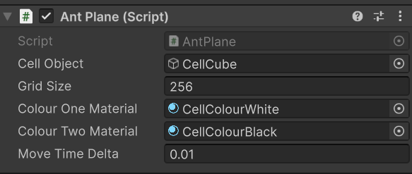

Unity project (version 6.0 (6000.0.51f1))

This is a project to experiment with Langton's Ant.

Firstly I have implemented the basic algorithm. Using clones of an object for the cells. Currently it assumes a square or cube to get the correct visual. Circle or sphere would also make sense, just have some gaps. Experimenting with other shapes and patterns will come.

Currently usage; appply AntPlane.cs to empty gameobject who's position will be the center (or close to) of the grid and its rotation will be used for the grid coords.

Cell Object         = Gameobject for each cell. SampleScene has it set to a cube object with starting material set.
Grid Size           = Square for now, this is both the row and col count.
Colour One Material = White in the original
Colour Two Material = Black in the original
Move Time Delta     = Time in seconds in between moves

Note: Ant is currently just a concept but we could easily put in a model or have the colour of the cell the ant is on be different.

